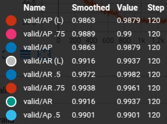
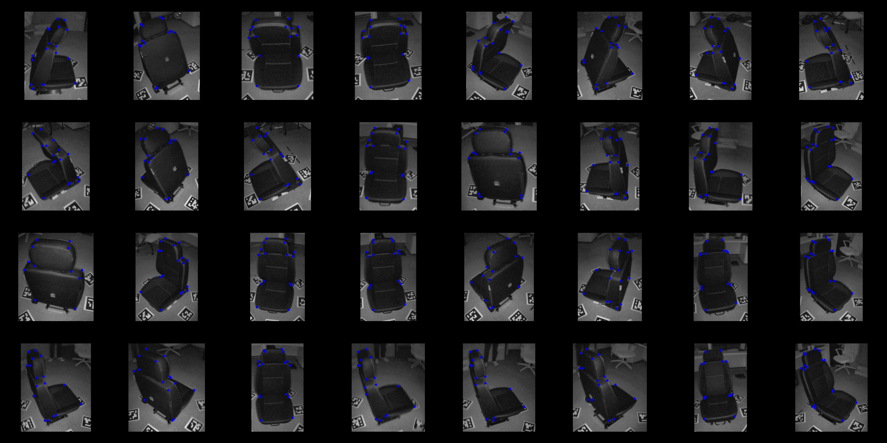
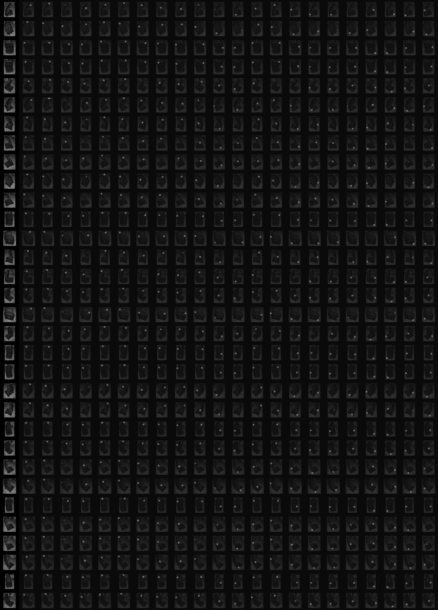

# Keypoint Detection Demo Repo
## Setting
0. ### Note
    This repository is optimized for Linux/Ubuntu, Windows requires modifications to `lib/nms/setup.py` and `lib/nms/nms_ketnel.cu`.

    **My environment**
    - Python : 3.12
    - OS : *Ubuntu 24.04* 
    - GPU : *RTX4070 Super*

    **Custom**
    - Replace deconv layer with upsample and conv2d for ti board (`lib/models/pose_resnet.py # _make_deconv_layer()`)

1. ### Install dependency
    ```
    pip install -r requirements.txt
    ```

2.  ### Make libs
    ```
    cd ${POSE_ROOT}/lib
    make
    ```

    If you encounter an error, refer to **0. Note.**
    
3. ### Install [COCOAPI](https://github.com/cocodataset/cocoapi):
   1. **install pycocotools**

        **Linux / Ubuntu**
        ```
        pip install pycocotools
        ```

        **Windows**
        ```
        pip install git+https://github.com/philferriere/cocoapi.git # subdirectory=PythonAPI

        ```
    2. **Copy and paste the attached pycocotools into the library installation directory of your virtual environment.**
        ```
        cp -r /{root}/pycocotools/. /home/{your_dir}/anaconda3/envs/{your_env}/lib/python3.{python_version}/site-packages/

        ```


## Data preparation
### 1. Make `{root}/data` dir

### 2. Put your dataset (COCO format)
```
.${root}/
    └── data/
        ├── train/
        │   ├── annotations.json
        │   ├── image_xxx.jpg
        │   ├── image_yyy.jpg
        │   └── ...
        ├── valid/
        │   ├── annotations.json
        │   ├── image_xxx.jpg
        │   ├── image_yyy.jpg
        │   └── ...
        └── test/
            ├── annotations.json
            ├── image_xxx.jpg
            ├── image_yyy.jpg
            └── ...
```

### 3. Edit `lib/dataset/coco.py` & `lib/dataset/JointsDataset.py` & `pycocotools/cocoeval.py`
    - find (control + f) `todo` and follow notes.


## Edit Config
Make your exp file.yaml in `experiments/coco/resnetXX/{your_exp_file}.yaml`

## Train 
`python pose_estimation/train.py --cfg experiments/coco/resnet50/{your_exp_file}.yaml`


## Test
`python pose_estimation/valid.py --cfg experiments/coco/resnet50/{your_exp_file}.yaml --model-file output/coco/pose_resnet_50/{your_exp}/model_best.pth.tar`

## Convert Onnx

`python export_onnx.py --cfg {your exp file}.yaml  --checkpoint {weight file}.pth`

---

## Demo Image




### **Reference**
**Simple Baselines for Human Pose Estimation and Tracking**
```
@inproceedings{xiao2018simple,
    author={Xiao, Bin and Wu, Haiping and Wei, Yichen},
    title={Simple Baselines for Human Pose Estimation and Tracking},
    booktitle = {European Conference on Computer Vision (ECCV)},
    year = {2018}
}
```